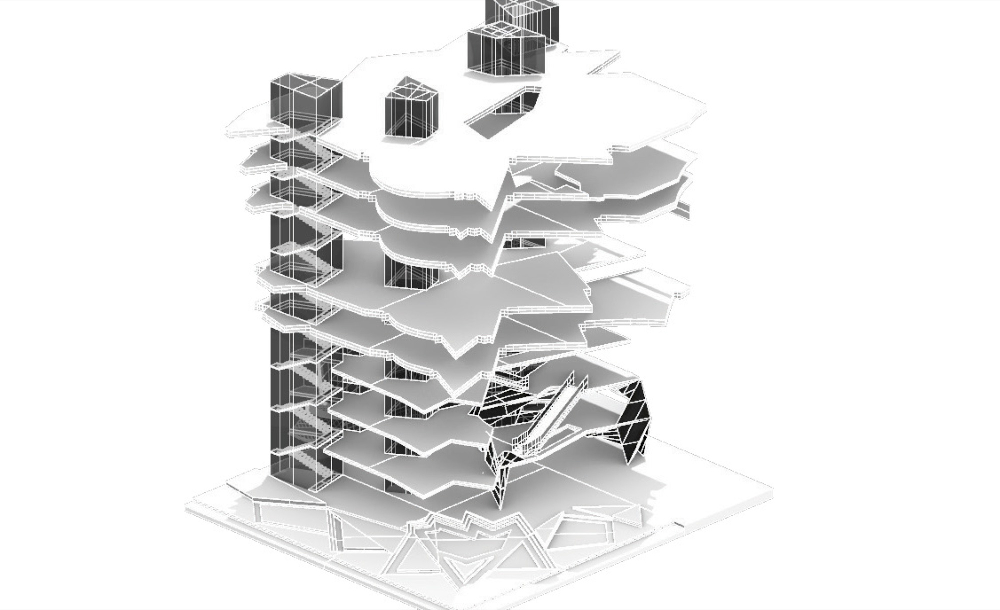
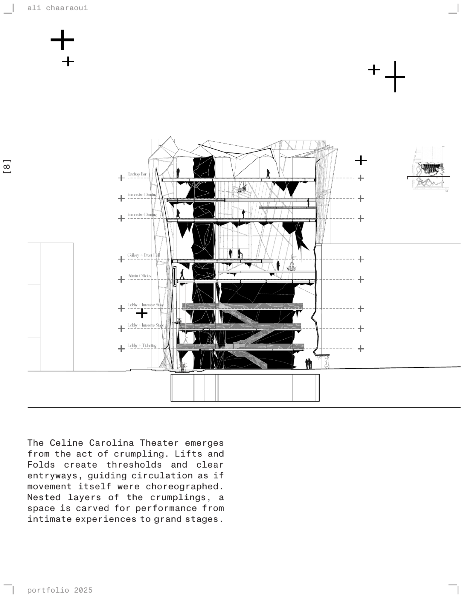
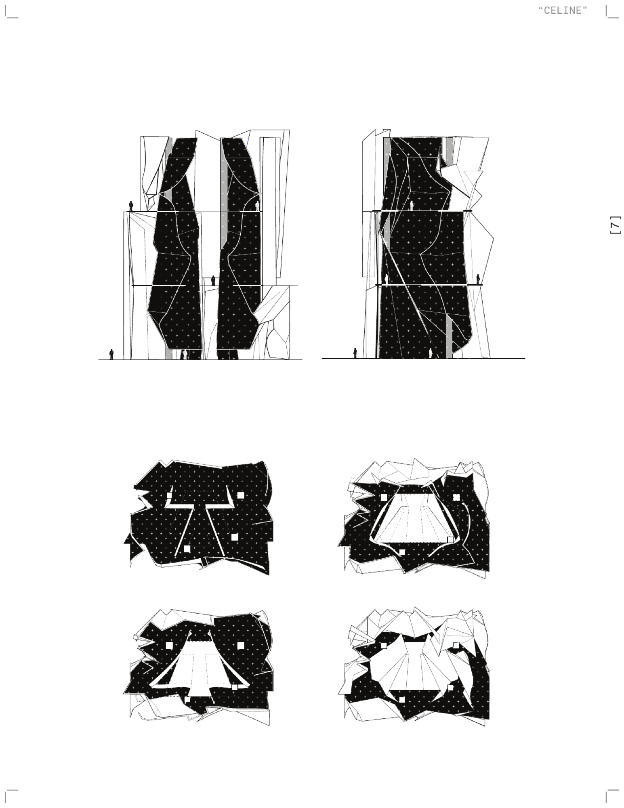
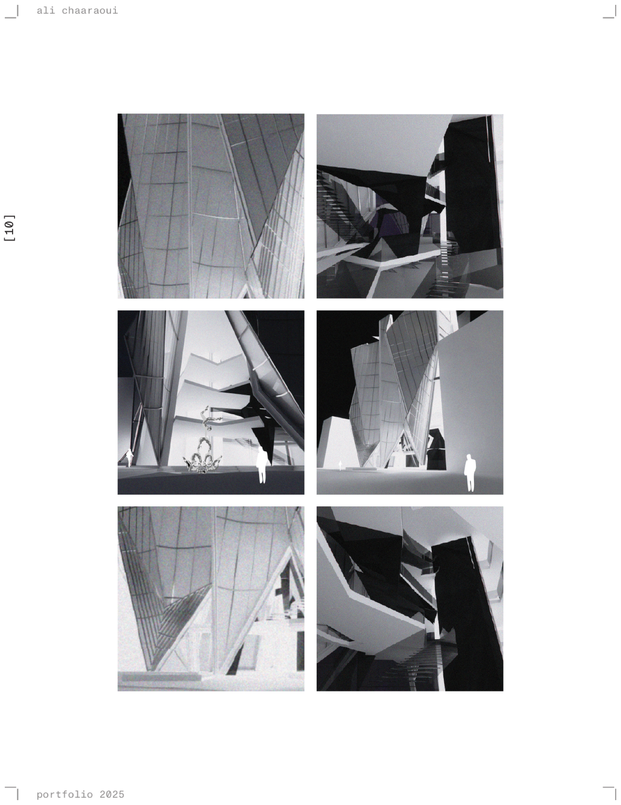

**A crumpled stage, where the building is the star.** The Carolina Theater
rebuilt as a performance like no other — the show, the circus.

## Crumpling as a technique

The study takes crumpling as a generative method and asks what irregular
folds will do: how they produce unexpected structural strength and surface
complexity. Crumpling established a formal vocabulary first, and the spatial
and architectural development followed from it rather than the other way
round.

Translating that logic into spatial and structural systems meant bridging,
multiplying and extending surfaces, relying on dry connections and
interlocking joints. The folds make moments of enclosure — walls, slabs and
structure at once — and the irregular geometry resolves into volumes that
hold themselves up.

## Section

Lifts and folds create thresholds and clear entryways, so circulation reads
as choreographed. Nested inside the crumplings, space is carved for
performance at every scale, from intimate rooms to the grand stage. The
building becomes both stage and scenography: every fold directs, every lift
frames, every nest houses.

## Inside

Set against the 1960s original — a house for black-box movies and celebrity
acts — this is an argument about what a theater might be next.
