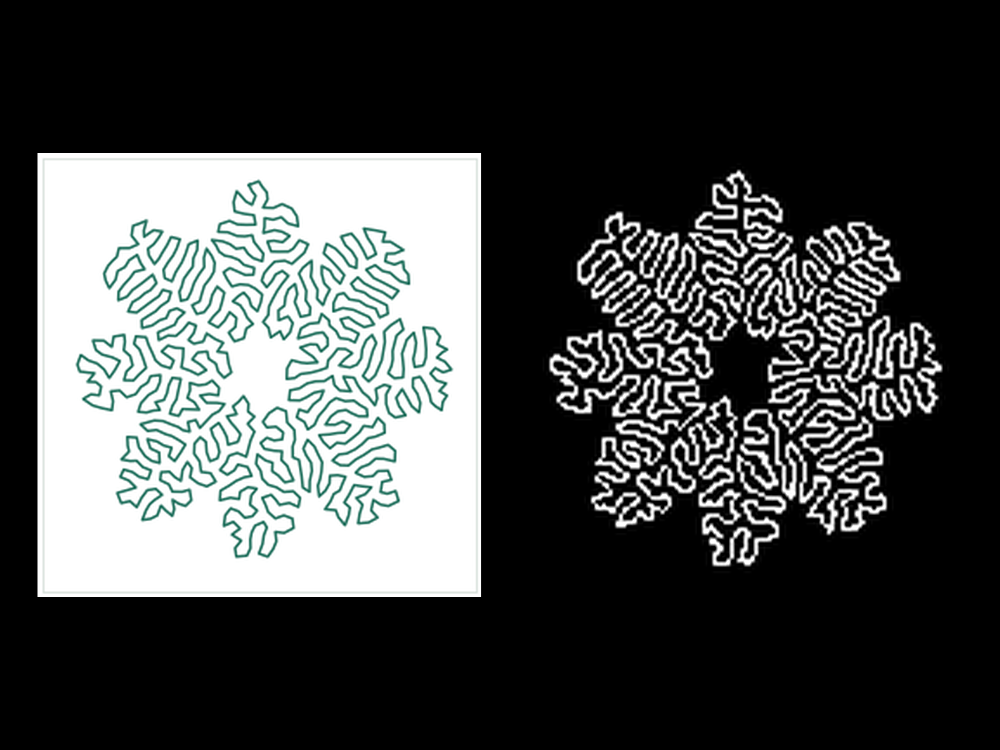
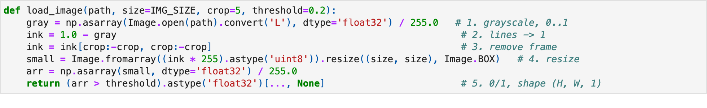
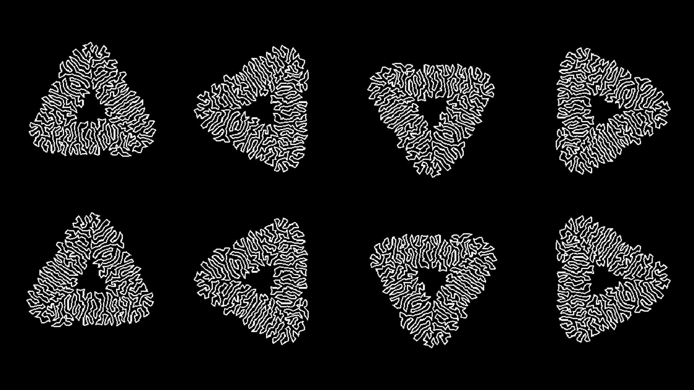
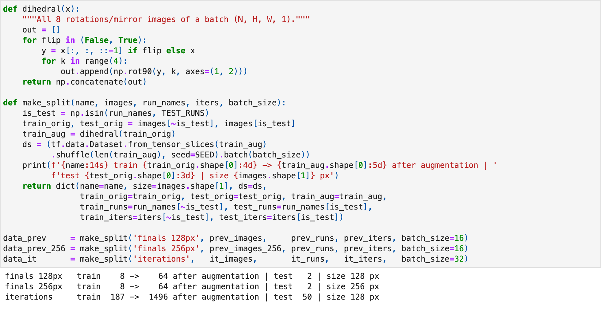
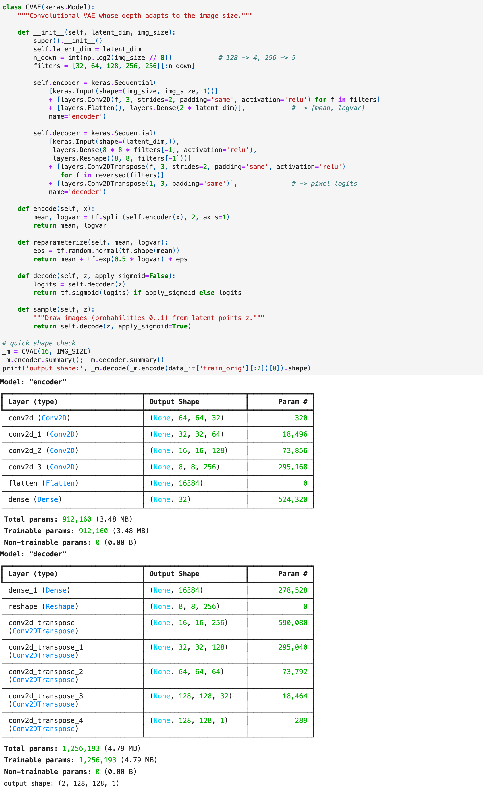
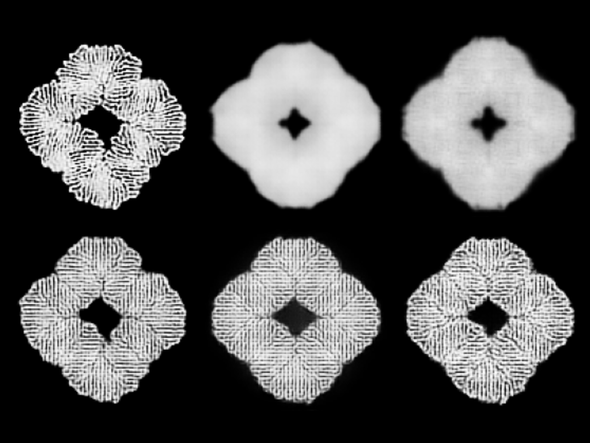
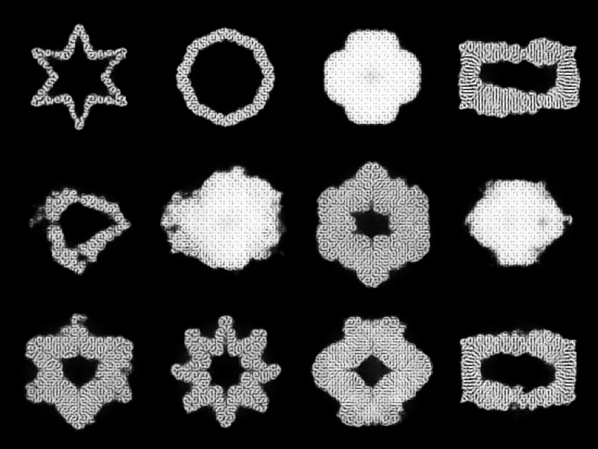
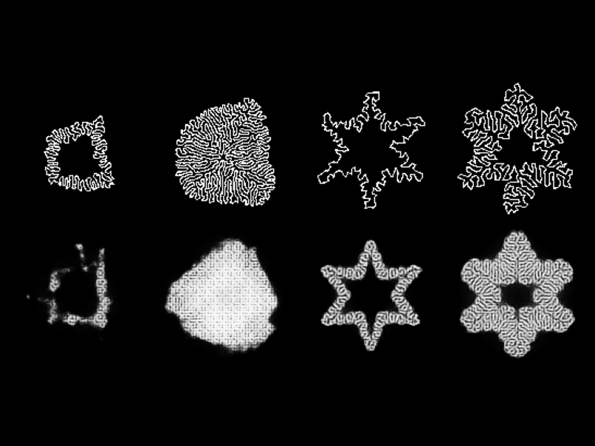

<!-- [DRAFT: written from your notebook, verify it and edit freely] -->

**Teaching a neural network what differential growth looks like**, so it
can redraw these patterns, invent new ones, and recognize ones it has
never seen.

## Data

**10 simulation runs**: 8 for training, 2 held back for testing. Each
image is cleaned to **black and white at 128 px**, then **rotated and
flipped 8 ways**, turning 187 training images into **1,496**.

## Model

A **convolutional variational autoencoder**: one half **squeezes an image
into 16 numbers**, the other **draws it back**. Those 16 numbers are a
position on a **map of patterns**, and picking a random point on the map
**invents a new one**.

## Experiments

**15 experiments, each changing one thing.** The texture only came back
once we added a **"look-alike" loss** that judges images the way a
pre-trained vision network (VGG16) sees them.

## Result

**The winner, D2, is the only model that makes whole, textured shapes.**

| Model | Textured | Whole shapes |
|---|---|---|
| C3: tidy map, no look-alike | no | yes |
| D1: look-alike, loose map | yes | mostly |
| **D2: both** | **yes** | **yes** |

It also **recognized the unseen 6-point star 4 out of 4 times**. The
random polygon, unlike anything in training, stayed far from every match.
**Next step: more runs.**

