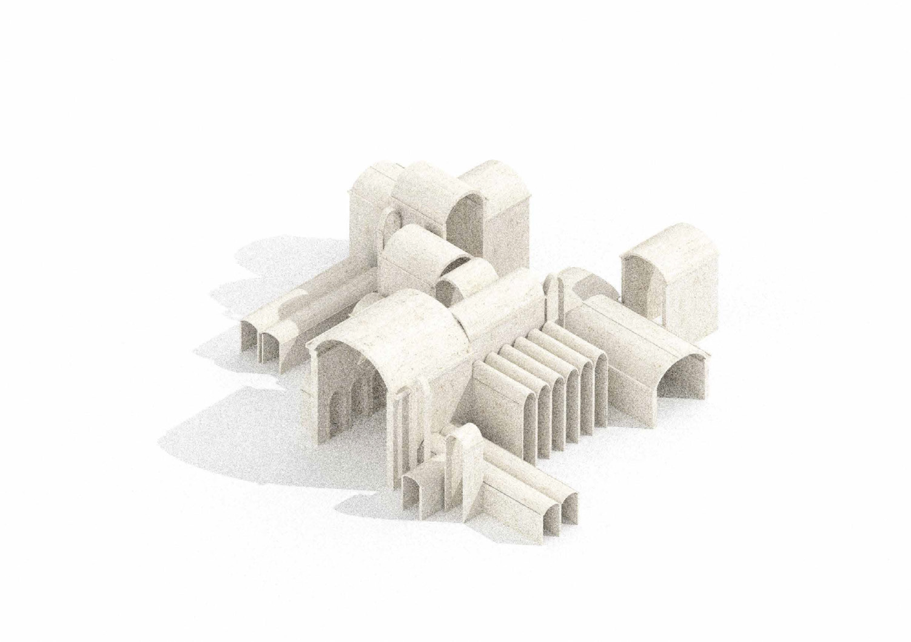
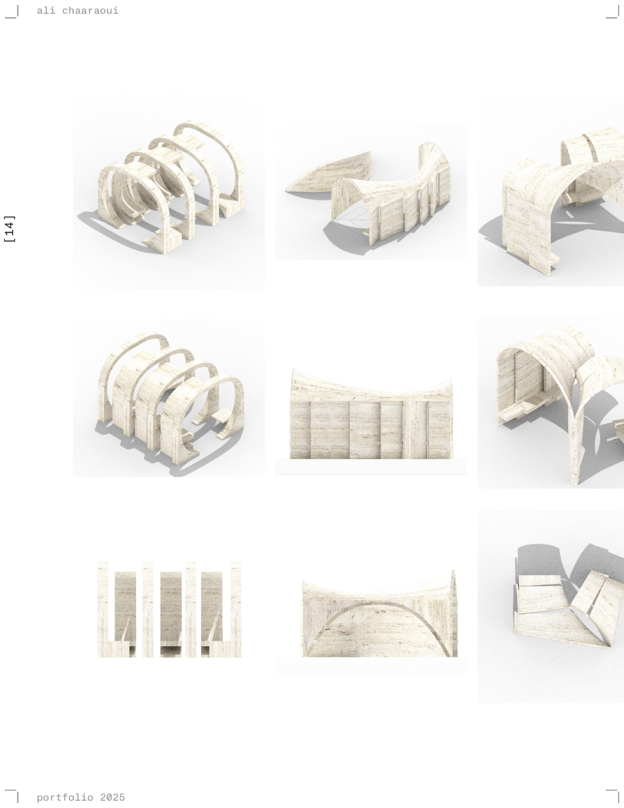
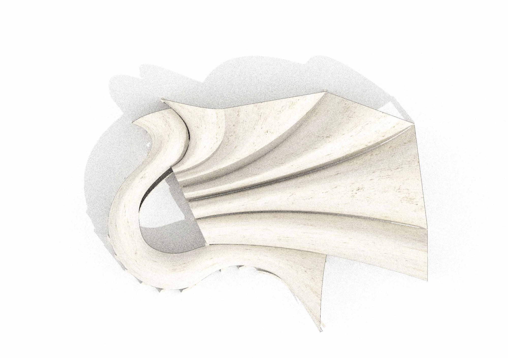

**A cover is a musical transformation through reinterpretation.** The project
begins with Kahn's Kimbell Art Museum, studied not as a fixed object but as a
source of generative order.

## The original as a source

Cast in place, the Kimbell's vaults and arches are carved, curved, elongated,
spanning sixty feet. Its repetition and composition create the spatial logic
of a large shed. The question the project asks is how far that original can
be stretched, carved and covered before it becomes something entirely new —
a precedent of its own.

## A kit of parts

At the scale of a shuttle stop the transformation begins. Elements are
deployed, repeated and re-assembled into a taxonomy: roof planes, columns,
apertures, seating. Each one is carved down, re-scaled, recomposed, stretched
and cut, to be deployed across multiple sites. Architecture mediates the
intimacy of waiting with the continuity of the city — a system that is
familiar yet re-contextualised through repetition and variation.

## Tectonics

The Kimbell's spans are elongated, widened and stretched as the vaults are
cut, curved and re-joined; re-scaled and re-proportioned into tectonic
experiments in threshold, rhythm and span. Not endpoints, but iterative
deployments of a form.
