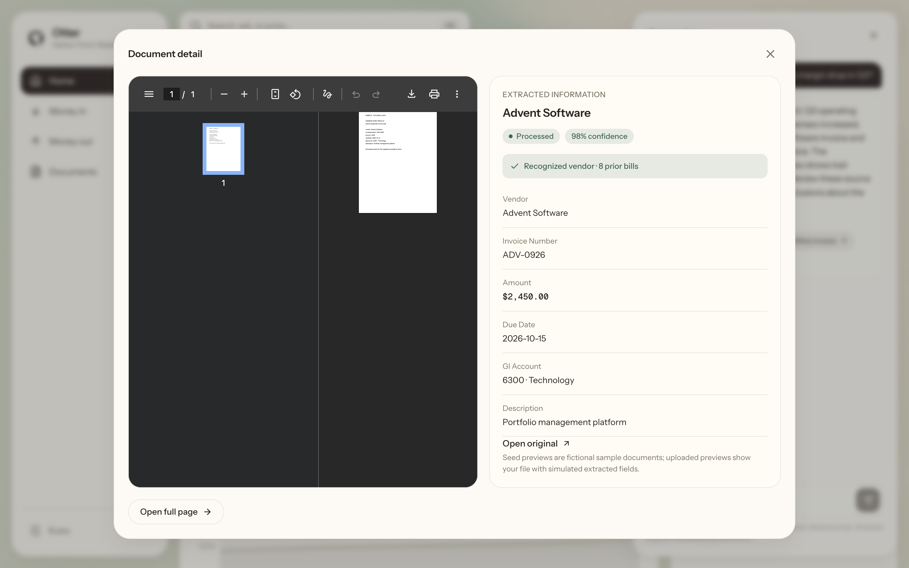
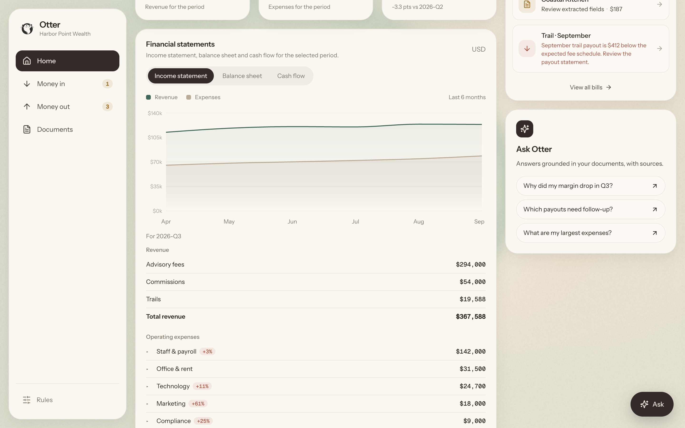

**A small advisory practice keeps its books in a filing cabinet and a
spreadsheet.** Otter does it instead, and shows its working.

## What I built

Otter was five of us over the hackathon weekend — it takes the invoices,
receipts and LPL payout statements a practice receives, routes each bill
through that practice's own approval rules, and answers questions about the
result in plain English with the document attached. Every figure in the demo
is fictional; the practice is called Harbor Point Wealth.

I owned the financial side and the approval path through it.

- The **double-entry ledger** and the chart of accounts, written so a
  journal entry is never half-posted — every entry is one DynamoDB
  transaction, all legs or none.
- **Financial statements** generated off that ledger: income statement,
  balance sheet, cash flow, and the subledger breakdown under each expense
  category that the accountant we spoke to asked for.
- **Revenue reconciliation**, matching an LPL payout statement line by line
  against the fee schedule and surfacing what did not tie out.
- The **side-by-side approval screen** — invoice on one side, extracted
  fields on the other, correct and approve in one pass.
- **Ask your books**, and specifically its citations: every answer points
  back at the document and the journal entry behind it, so a number is
  never just asserted.

## On AWS

The whole thing is serverless. Nothing in it is a server we kept warm.

| Layer | Service | Why that one |
|---|---|---|
| Hosting, sign-in | Amplify Hosting, Cognito | Deploys from `main`; the role comes out of the ID token, and the backend enforces the same rules |
| API | API Gateway HTTP API, Lambda (Python 3.12, arm64) | Pay per request, JWT-authorized at the edge |
| Document AI | Textract, Bedrock (Claude) | Textract for purpose-built invoice extraction; Bedrock to classify and normalise what it returns |
| Orchestration | Step Functions, EventBridge | An upload raises an event; the workflow is auditable step by step |
| Approvals | Step Functions `waitForTaskToken` | Human-in-the-loop without polling or a queue of our own |
| Records | S3 with Object Lock | Write-once books and records, SEC 17a-4 style |
| Ledger | DynamoDB transactions | A journal is never half-written |
| Q&A safety | Bedrock Guardrails | No investment advice, PII masked on the way out |
| Observability | CloudWatch, CloudTrail | Every workflow step and every decision is traceable |

## How a document becomes a bill

The interesting part is that no step trusts the one before it.

A file is uploaded straight to **S3** through a presigned URL. The object
landing raises an **EventBridge** event, which starts the `IngestDocument`
**Step Function**: classify, extract with **Textract**, normalise through
**Bedrock**, match the vendor, create the bill. Each step writes its own
result, so when a field comes out wrong you can see which stage produced it.

Approval is a second workflow. `ApproveBill` evaluates the practice's rules,
then parks on `waitForTaskToken` until a human decides — which is what makes
the wait durable rather than a row in a table somebody has to poll. Only
once it resumes does the ledger get posted and the payment get scheduled.

## Rules the system actually enforces

Segregation of duties is not a UI convention here — the backend refuses it.
Nobody can approve a bill they uploaded themselves, a partner sees only what
is routed to them, and the LPL bookkeeper is read-only. The role arrives in
the Cognito ID token and every Lambda checks it independently of what the
frontend chose to render.

## Answers that cite their source

Ask your books runs over the ledger and the document store rather than over
a vector index of loose text, so an answer resolves to specific journal
entries and specific documents. The Bedrock Guardrail sits in front of the
response: it will not give investment advice, and it masks personal
information before anything is returned.

