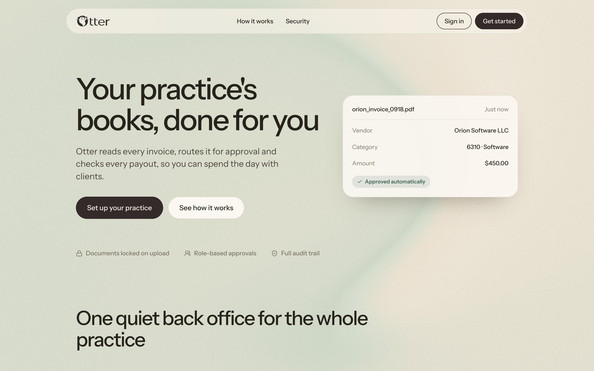
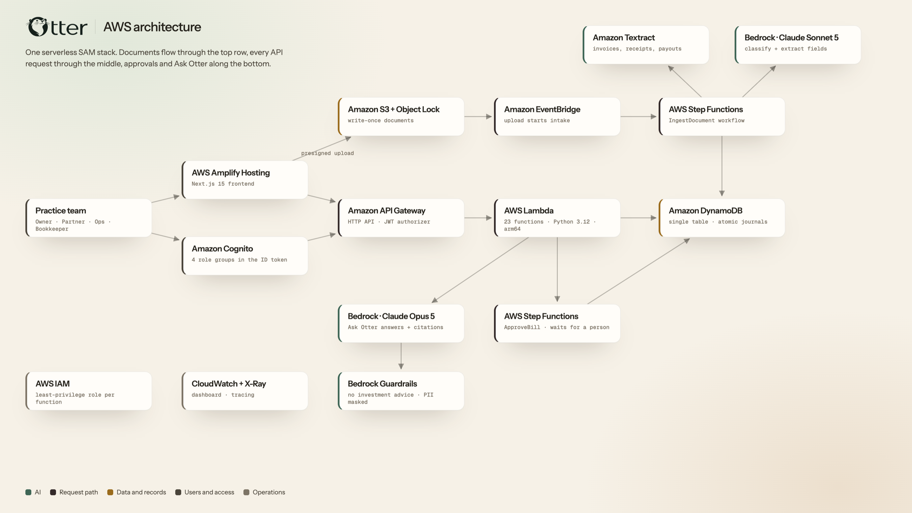

**A small advisory practice keeps its books in a filing cabinet and a
spreadsheet.** Otter does it instead, and shows its working.

## Signing up

## Reading a document

Textract pulls the fields; Claude Sonnet classifies the document and
normalises what comes back. Nothing is posted until a person confirms it.

## Approvals

Each practice writes its own rules. Nobody can approve a bill they uploaded.

## Reconciling a payout

Line by line against the fee schedule, with whatever failed to tie out
surfaced rather than buried.

## Ask your books

Claude Opus answers over the ledger and the documents, and every answer
carries the journal entry and the document behind it.

## On AWS

Twenty-three Lambda functions on Python 3.12, a single DynamoDB table for the
ledger, documents written once into S3 with Object Lock, and two Step
Functions workflows — one that reads every upload, one that waits for a human.
[Open the diagram full size ↗](/otter-aws-architecture.png)

## The pitch

