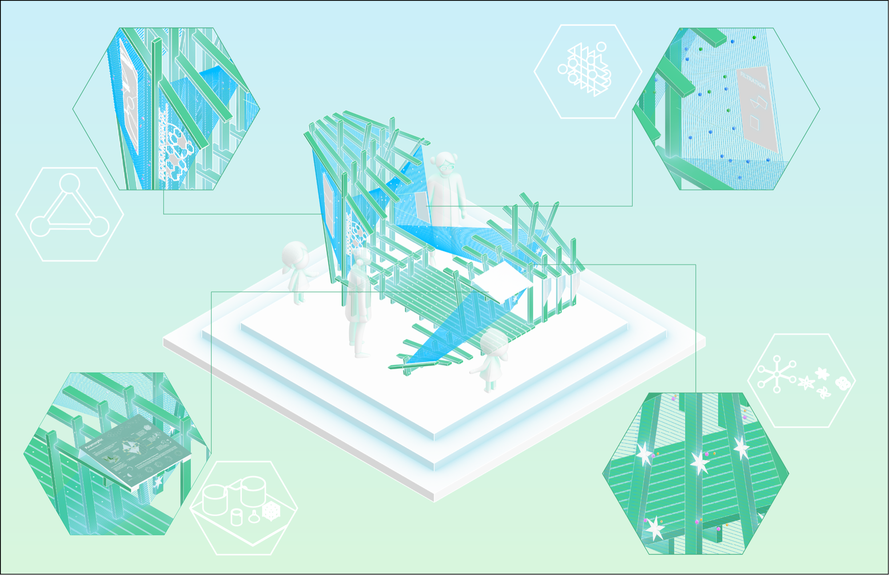
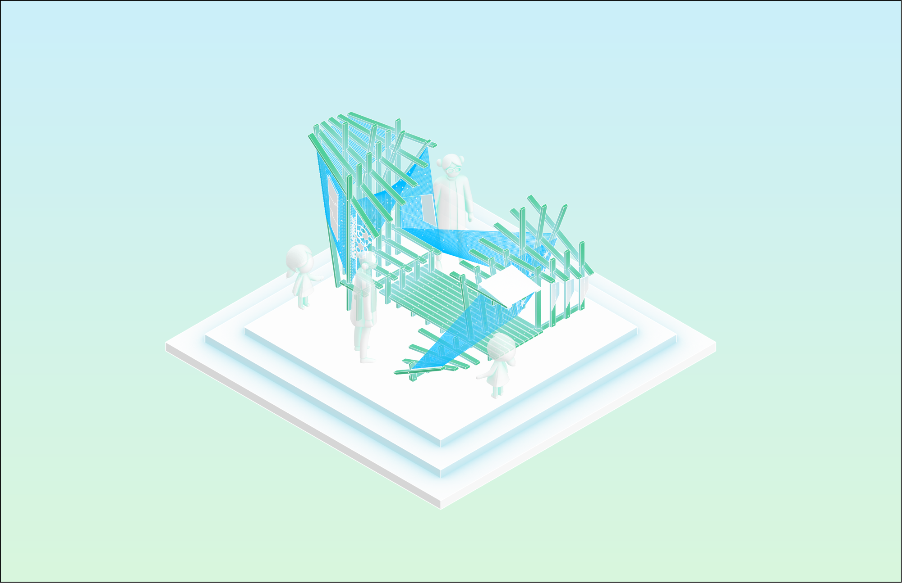
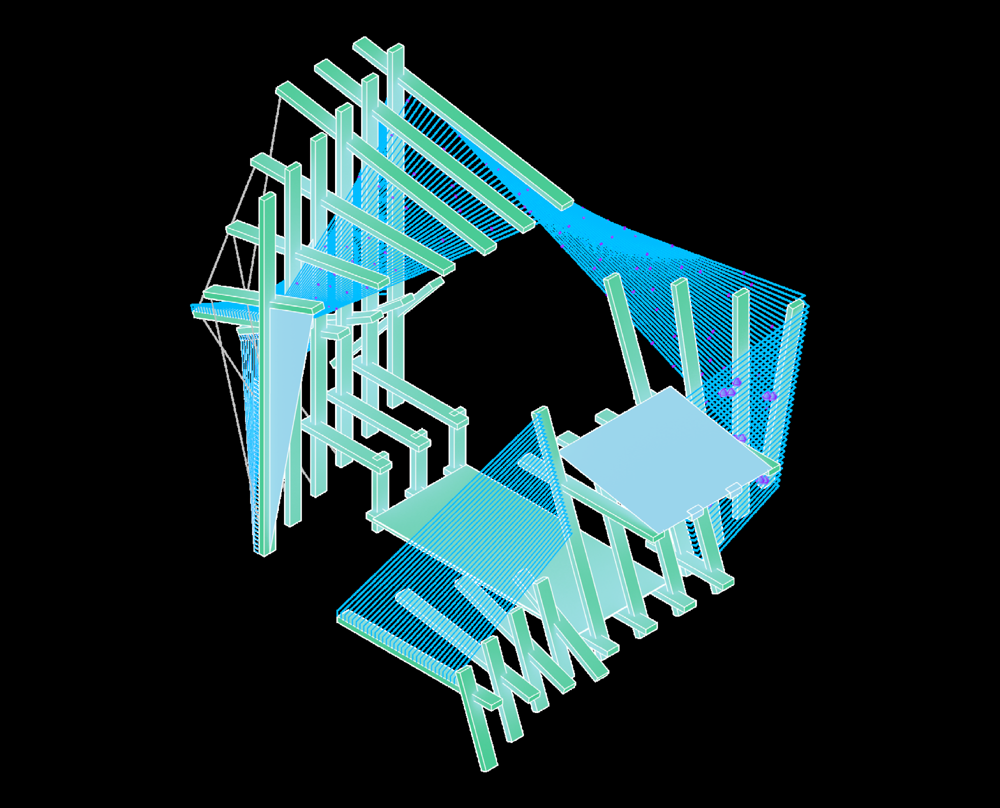

**A study of how scientific logic translates into spatial intuition** —
playful but still thoughtful, serious without losing a sense of wonder.

## Curiosity as the method

Here understanding does not arrive through explanation but through
interaction. Curiosity becomes the method; movement becomes the lesson. The
MOF — a metal-organic framework — is not only a scientific structure but a
way of thinking, about filtration, connectivity, and the subtle forces that
shape both matter and experience.

## Growing the structure

The morphosis of the pop-up museum starts with a single unit, then copied
and mirrored, grown and expanded, rotated and finally filtered — mimicking
the way MOFs grow and are used.

## Five programmes

Across five project phases we developed a design language and a technique
using wood studs, producing different programmatic installations all
relating back to MOFs and chemistry: somewhere to sit, a place to
demonstrate, a display, shade, and finally the museum itself.
