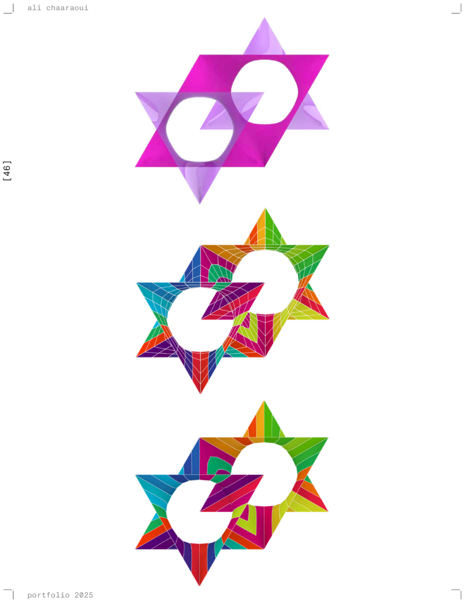
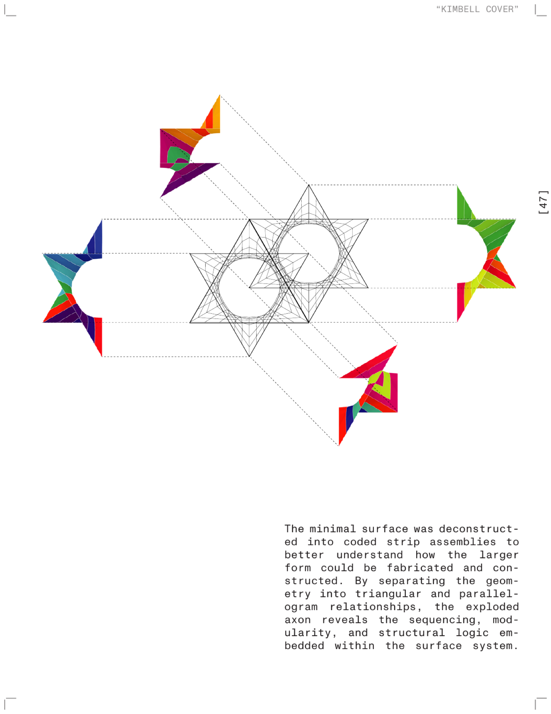

**How computational form-finding turns a triangle into a surface.** The
Schwarz D is a minimal surface; this project asks what it takes to build one.

## Form-finding

Starting from a simple triangular geometry, the surface is found rather than
drawn. Mesh relaxation, mirrored quad panels and Kangaroo Physics
simulations let the geometry settle into a continuous minimal surface — one
that holds its shape because of how it is relaxed, not because it was
modelled that way.

## Aggregation

Once the unit resolves, it aggregates. The result is a smooth spatial
lattice capable of variation and, with the panelisation resolved, of
fabrication.
