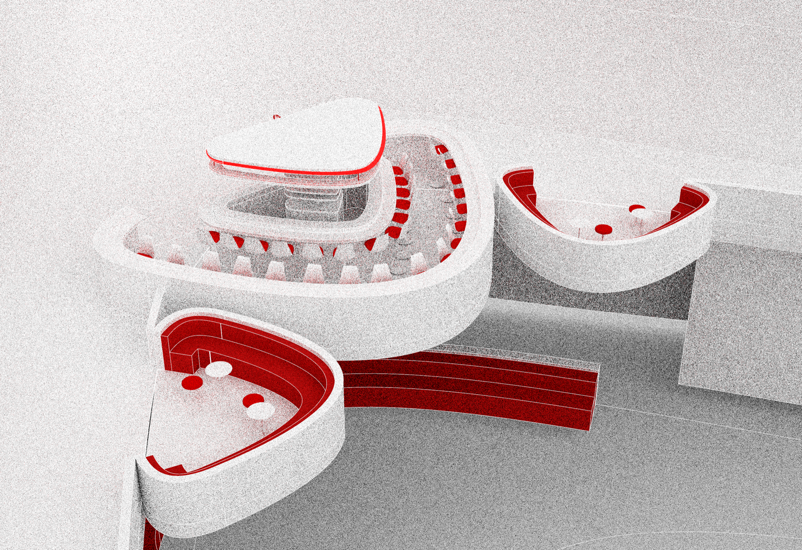

**More than a transit hub.** The Charlotte Train Station as a cultural and
social landmark — movement, commerce and performance in one building.

## A gateway and a destination

Sitting at a central urban point in Charlotte, the station positions itself
as both a way into the city and somewhere to go in its own right. The
concourse is sized for crowds but detailed for the minutes people actually
spend in it.

Set in the spirit of the 1960s, the design is manipulated to evoke what
retro-futurism might have looked like. Fusing futuristic form with nostalgic
elements, the space offers a social hub rather than a waiting room. Bold
lines and neon accents carry the idea; the bar and pop-up stores animate the
station further, giving it retail and social life that changes over time and
blurs the boundary between past and future.

## Model

